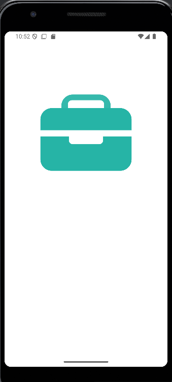
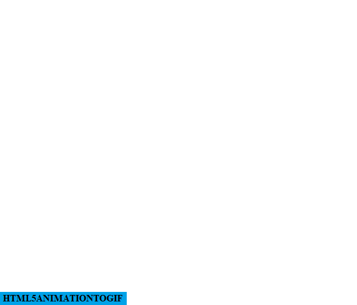

# <u>Splash Screen</u>

###### Screenshot:

This is the animation which was taken from LottieFiles and implemented as the splash screen of the app using Jetpack Compose. 
The steps to implement the animated splash screen are listed below: 
<u>Link to animation:</u> <a href="https://app.lottiefiles.com/animation/5bb15afe-d79b-45f3-b970-32a00215a545" target="_blank">LottieFiles - Reading Animation</a>

---

### 🌟 Implementation Steps:

<ol>
  <li>
    <u><b>Download the animation as a JSON file</b></u> 
    - Visit the <a href="https://app.lottiefiles.com/animation/5bb15afe-d79b-45f3-b970-32a00215a545" target="_blank">LottieFiles animation page</a>. 
    - Click the "Download" button and choose the option <code>Lottie JSON</code> to save the animation locally.  
  </li>

  <li>
    <u><b>Add required dependencies to your project</b></u> 
    In your <code>build.gradle</code> file (app-level), include the following for Jetpack Compose and Lottie support:
    <pre>
implementation 'com.airbnb.android:lottie-compose:6.0.0'
implementation 'androidx.compose.ui:ui:1.6.0'
    </pre> 
  </li>

  <li>
    <u><b>Create your SplashScreen Composable</b></u> 
    Define a Composable function that loads and animates the Lottie file:
    <pre>
@Composable
fun SplashScreen() {
    val composition by rememberLottieComposition(LottieCompositionSpec.Asset("reading.json"))
    val progress by animateLottieCompositionAsState(composition)
    
    Box(modifier = Modifier.fillMaxSize(), contentAlignment = Alignment.Center) {
        LottieAnimation(composition, progress)
    }
}
    </pre> 
  </li>

  <li>
    <u><b>Trigger navigation after splash screen</b></u> 
    Use a coroutine and delay to move to the next screen:
    <pre>
LaunchedEffect(Unit) {
    delay(3000)
    navController.navigate("HomeScreen")
}
    </pre> 
  </li>
</ol>

---

### ✨ Outcome:
Using Jetpack Compose and LottieFiles, your app now features a smooth, lightweight, and visually engaging splash screen that adds a delightful touch to the user experience.

---
